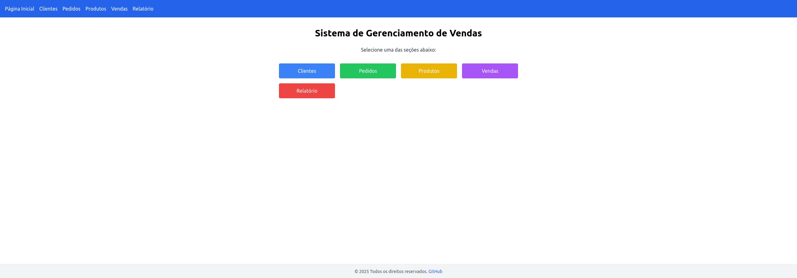

# 🛒 Vendas Online - Sistema de Gerenciamento de Vendas

Aplicação web **Full Stack** para controle de vendas, pedidos, produtos e clientes. Desenvolvido com **Spring Boot** no back-end e **React + Vite** com **TailwindCSS** no front-end. 

Permite que vendedores registrem pedidos, acompanhem status e acessem relatórios de desempenho. Tudo é executado com um único comando via **Docker Compose**.



**Acesse a aplicação:**

🔗 [https://vendasonline-pjb0.onrender.com/](https://vendasonline-pjb0.onrender.com/)

---

## 📂 Estrutura do Projeto

```
aplicacao-fullstack/
├── app-front/                       # Aplicação React (Frontend)
│   ├── public/
│   ├── src/
│   │   ├── assets/
│   │   ├── components/              # Componentes reutilizáveis
│   │   ├── pages/                   # Páginas principais
│   │   ├── services/                # Requisições HTTP (axios)
│   │   ├── App.css
│   │   ├── App.tsx
│   │   ├── index.css
│   │   ├── main.tsx
│   │   └── vite-env.d.ts
│   ├── eslint.config.js
│   ├── index.html
│   ├── package.json
│   ├── postcss.config.js
│   ├── tailwind.config.js
│   ├── tsconfig.json
│   └── vite.config.ts                # Configuração Vite (proxy etc.)
│
├── vendasonline/                     # Backend Java Spring Boot
│   └── src/                          
│       ├── main/
│       │   ├── java/
│       │   │   └── com/shop/vendasonline/
│       │   │       ├── controller/   # Controllers REST
│       │   │       ├── dto/          # DTOs (Data Transfer Objects)
│       │   │       ├── mapper/       # Mapeamentos com MapStruct
│       │   │       ├── model/        # Entidades JPA
│       │   │       ├── repository/   # Interfaces de repositórios
│       │   │       ├── service/      # Regras de negócio
│       │   │       ├── VendasOnlineApplication.java
│       │   └── resources/
│       │       ├── application.properties
│       │       └── static/           # Onde o React será empacotado (build)
│       ├── mvnw, mvnw.cmd            # Wrapper Maven
│       └── pom.xml                   # Dependências do projeto Spring Boot
├── Dockerfile                        # Docker para backend
├── docker-compose.yml                # Sobe backend + frontend integrados
├── LICENSE
└── README.md 
```

---

## 🚀 Tecnologias Utilizadas

### 🔧 Back-end
- Java 17+
- Spring Boot 3+
- Spring Data JPA
- Spring Security
- H2 Database (dev)
- Maven

### 💻 Front-end
- React
- TypeScript
- Vite
- TailwindCSS
- Axios
- React Router DOM

### 🐳 DevOps
- Docker
- Docker Compose

---

## 📦 Funcionalidades

- CRUD completo de:
  - Clientes
  - Produtos
  - Pedidos
  - Vendas
- Relatórios e resumos de vendas
- Listagem de clientes mais ativos
- Integração total entre front-end e back-end via REST API
- Permissões de CORS configuradas para integração
- Deploy local com um único comando (`docker-compose up`)

---

## 📝 Cadastro de dados

Use a interface do front-end para:

- Cadastrar e gerenciar clientes, produtos, pedidos e vendas
- Gerar relatórios de desempenho e status
- Visualizar o status e resumo de vendas em tempo real

As ações são enviadas por meio de chamadas REST ao backend em Spring Boot.

---

## ⚙️ Como Executar

### ✅ Requisitos

- Docker e Docker Compose **ou**
- Java 17+, Node.js 20+ e npm

### 🔁 Rodando com Docker (Recomendado)

```bash
docker-compose up --build
```

- API disponibilizada em: `http://localhost:8081/`  
- A interface React será carregada estaticamente nesse mesmo endereço.

### 🔧 Rodando Manualmente (Separado)

1. **Backend:**

```bash
cd vendasonline
./mvnw spring-boot:run
```

2. **Frontend:**

```bash
cd app-front
npm install
npm run dev
```

- Frontend disponível em: [http://localhost:5173](http://localhost:5173)

---

## 🛠️ Instalação e Configuração

### Variáveis de ambiente

O projeto utiliza variáveis de ambiente para configurar a URL base da API no front-end, facilitando o uso em diferentes ambientes (desenvolvimento local, produção no Render etc).

Crie os arquivos `.env` dentro da pasta `app-front`:

- `.env.development`

```env
VITE_API_BASE_URL=http://localhost:8081/api/v1
```

- `.env.production`

```env
VITE_API_BASE_URL=https://vendasonline-pjb0.onrender.com/api/v1
```

> ⚠️ **Importante:** Nunca comite arquivos `.env` com dados sensíveis. Adicione-os ao `.gitignore`.

---

### Docker

No arquivo `docker-compose.yml`, você pode passar a variável de ambiente para o build do front-end:

```yaml
services:
  app:
    build:
      context: .
      args:
        VITE_API_BASE_URL: http://localhost:8081/api/v1
    environment:
      - VITE_API_BASE_URL=http://localhost:8081/api/v1
    ports:
      - "8081:8081"
```

No Render ou outra plataforma de hospedagem, defina a variável `VITE_API_BASE_URL` pelo painel da aplicação.

---

## 🔐 Segurança

- A configuração CORS permite chamadas seguras do front-end (http://localhost:5173)
- Fácil extensão para produção com autenticação JWT ou OAuth2 (não implementado nesta versão)

---

## 📄 Licença

Este projeto está licenciado sob a licença MIT.
