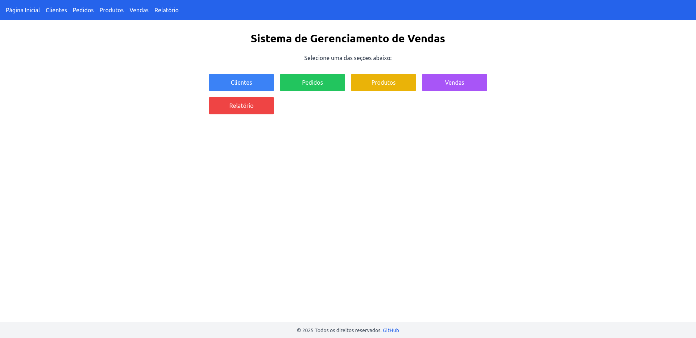

# 🛒 Vendas Online - Sistema de Gerenciamento de Vendas

Aplicação web **Full Stack** para controle de vendas, pedidos, produtos e clientes. Desenvolvido com **Spring Boot** no back-end e **React + Vite** com **TailwindCSS** no front-end. 

Permite que vendedores registrem pedidos, acompanhem status e acessem relatórios de desempenho. Tudo é executado com um único comando via **Docker Compose**.



🔗 **Acesse a aplicação:**
[https://aplicacao-fullstack.vercel.app/](https://aplicacao-fullstack.vercel.app/)

---
## 📑 Sumário

- [📂 Estrutura do Projeto](#-estrutura-do-projeto)  
- [🚀 Tecnologias Utilizadas](#-tecnologias-utilizadas)  
- [📦 Funcionalidades](#-funcionalidades)  
- [📝 Cadastro de Dados](#-cadastro-de-dados)  
- [⚙️ Como Executar](#️-como-executar)  
- [🛠️ Configuração](#️-configuração)
- [🗃️ Banco de Dados](#%EF%B8%8F-banco-de-dados)
- [🔐 Segurança](#-segurança)  
- [📄 Licença](#-licença)

---

## 📂 Estrutura do Projeto

```
aplicacao-fullstack/
├── app-front/                       # Aplicação React (Frontend)
│   ├── public/
│   ├── src/
│   │   ├── assets/
│   │   ├── components/              # Componentes reutilizáveis
│   │   ├── pages/                   # Páginas principais
│   │   ├── services/                # Requisições HTTP (axios)
│   │   ├── App.css
│   │   ├── App.tsx
│   │   ├── index.css
│   │   ├── main.tsx
│   │   └── vite-env.d.ts
│   ├── eslint.config.js
│   ├── index.html
│   ├── package.json
│   ├── postcss.config.js
│   ├── tailwind.config.js
│   ├── tsconfig.json
│   └── vite.config.ts                # Configuração Vite e Proxy
│
├── vendasonline/                     # Backend Java Spring Boot
│   └── src/                          
│       ├── main/
│       │   ├── java/
│       │   │   └── com/shop/vendasonline/
│       │   │       ├── controller/   # Controllers REST
│       │   │       ├── dto/          # DTOs (Data Transfer Objects)
│       │   │       ├── mapper/       # Mapeamentos com MapStruct
│       │   │       ├── model/        # Entidades JPA
│       │   │       ├── repository/   # Interfaces de repositórios
│       │   │       ├── service/      # Regras de negócio
│       │   │       ├── VendasOnlineApplication.java
│       │   └── resources/
│       │       ├── application.properties
│       │       └── static/           # Onde o React será empacotado (build)
│       ├── mvnw, mvnw.cmd            # Wrapper Maven
│       └── pom.xml                   # Dependências do projeto Spring Boot
├── Dockerfile                        # Docker para backend
├── docker-compose.yml                # Orquestra frontend e backend
├── LICENSE
└── README.md 
```

---

## 🚀 Tecnologias Utilizadas

### 🔧 Back-end
- Java 17+
- Spring Boot 3+
- Spring Data JPA
- Spring Security
- H2 Database (dev)
- Maven

### 💻 Front-end
- React
- TypeScript
- Vite
- TailwindCSS
- Axios
- React Router DOM

### 🐳 DevOps
- Docker
- Docker Compose

---

## 📦 Funcionalidades

- CRUD completo de:
  - Clientes
  - Produtos
  - Pedidos
  - Vendas
- Relatórios e resumos de vendas
- Listagem de clientes mais ativos
- Integração total entre front-end e back-end via REST API
- Permissões de CORS configuradas para integração
- Deploy local com um único comando (`docker-compose up`)

---

## 📝 Cadastro de dados

Use a interface do front-end para:

- Cadastrar e gerenciar **clientes, produtos, pedidos e vendas**
- Gerar **relatórios de desempenho e status**
- Visualizar **status de pedidos** e **resumos de vendas em tempo real**

As ações são enviadas por meio de chamadas REST ao backend em Spring Boot.

---

## ⚙️ Como Executar

### ✅ Requisitos

- Docker e Docker Compose **ou**
- Java 17+, Node.js 20+ e npm

### 🔁 Rodando com Docker (Recomendado)

```bash
docker-compose up --build
```

- API disponibilizada em: [http://localhost:8081/](http://localhost:8081/) 
- A interface React será carregada estaticamente nesse mesmo endereço.

### 🔧 Rodando Manualmente (Separado)

1. **Backend:**

```bash
cd vendasonline
./mvnw spring-boot:run
```

2. **Frontend:**

```bash
cd app-front
npm install
npm run dev
```

- Frontend disponível em: [http://localhost:5173](http://localhost:5173)

---

## 🛠️ Configuração

### 🌐 Variáveis de Ambiente

O front-end utiliza variáveis de ambiente para configurar a URL base da API, facilitando o uso em ambientes distintos (desenvolvimento local, produção etc).

Crie os arquivos dentro de `app-front`:

#### `.env.development`
```env
VITE_API_BASE_URL=http://localhost:8081/api/v1
```

#### `.env.production`
```env
VITE_API_BASE_URL=https://aplicacao-fullstack-production.up.railway.app/api/v1
```

> ⚠️ **Importante:** Nunca comite arquivos `.env` com dados sensíveis. Adicione ao `.gitignore`.

### ⚙️ Docker: Variáveis no `docker-compose.yml`

```yaml
services:
  app:
    build:
      context: .
      args:
        VITE_API_BASE_URL: http://localhost:8081/api/v1
    environment:
      - VITE_API_BASE_URL=http://localhost:8081/api/v1
    ports:
      - "8081:8081"
```

Em produção (Railway, Render etc.), defina `VITE_API_BASE_URL` diretamente no painel de variáveis da plataforma.

---

## 🗃️ Banco de Dados

A aplicação utiliza o banco de dados **H2** em memória no ambiente de desenvolvimento, permitindo testes rápidos e simples sem necessidade de instalação adicional.

### 🔍 Características

- Banco leve, relacional, baseado em Java.
- Inicializado automaticamente com a aplicação.
- Credenciais padrão (configuráveis no `application.properties`):

### 🧱 Estrutura de Tabelas

O banco é gerado automaticamente com base nas entidades JPA definidas em `vendasonline/src/main/java/com/shop/vendasonline/model/`, incluindo:

> Em produção, você pode facilmente alterar para outro banco (PostgreSQL, MySQL, etc.) editando as configurações no `application.properties` e adicionando a dependência correspondente no `pom.xml`.

---

## 🔐 Segurança

- Configuração CORS permite chamadas seguras entre front-end e back-end.
- Estrutura preparada para futura integração com autenticação via JWT ou OAuth2 (não implementado nesta versão).

---

## 📄 Licença

Este projeto está licenciado sob a [licença MIT](LICENSE).
